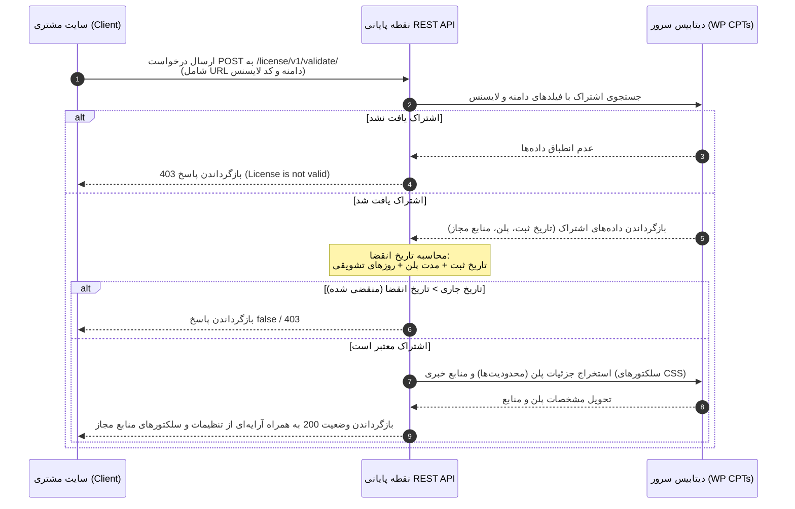

# مستندات جامع افزونه مدیریت دستیار ناشر (Co-Publisher Manager)

این مستند به منظور تشریح ساختار، تکنولوژی‌ها، ماژول‌ها، جریان داده و راهنمای توسعه افزونه **Co-Publisher Manager (cop-manager)** تنظیم شده است تا توسعه‌دهندگان و سیستم‌های هوش مصنوعی بتوانند در کوتاه‌ترین زمان ممکن با پروژه آشنا شده و توسعه آن را آغاز کنند.

---

## ۱. ساختار دایرکتوری‌ها و سازماندهی پروژه

پروژه به صورت یک افزونه (Plugin) استاندارد وردپرس ساختاردهی شده است. ساختار دایرکتوری‌ها و وظیفه هر یک به شرح زیر است:

```text
cop-manager/
├── assets/                  # فایل‌های استاتیک و ظاهری
│   ├── css/
│   │   └── select2.min.css  # استایل‌های کتابخانه Select2 برای بهبود دراپ‌داون‌ها
│   ├── js/
│   │   └── select2.min.js   # جاوااسکریپت کتابخانه Select2
│   ├── calendar.svg         # آیکون مربوط به پست تایپ پلن‌ها
│   └── user-cart.svg        # آیکون مربوط به پست تایپ اشتراک‌ها
├── inc/                     # منطق و بخش‌های پردازشی افزونه
│   ├── helper_functions.php # توابع کمکی، لودرهای دراپ‌داون و منطق تولید کد لایسنس
│   └── restapi.php          # تعریف نقاط پایانی (Endpoints) REST API جهت احراز هویت لایسنس
├── post-types/              # تعریف انواع پست‌های سفارشی (Custom Post Types)
│   ├── plans.php            # مدیریت پست تایپ پلن‌ها (Plans) و متادیتاهای مربوطه
│   ├── resources.php        # مدیریت پست تایپ منابع خبری (Resources) و سلکتورهای استخراج محتوا
│   └── subscriptions.php    # مدیریت پست تایپ اشتراک‌ها (Subscriptions) و فیلدهای اختصاصی
└── index.php                # فایل اصلی و نقطه ورود افزونه (لودر ماژول‌ها)
```

---

## ۲. تکنولوژی‌ها و وابستگی‌های کلیدی

افزونه بر پایه معماری ماژولار وردپرس توسعه یافته و از ابزارها و تکنولوژی‌های زیر بهره می‌برد:

| بخش / ابزار | تکنولوژی / کتابخانه | نسخه / توضیحات |
| :--- | :--- | :--- |
| **زبان برنامه‌نویسی سمت سرور** | PHP | نسخه 7.4 یا بالاتر |
| **هسته سیستم** | WordPress API | استفاده از سیستم Custom Post Types و Custom Meta Boxes و REST API |
| **فرانت‌اند و رابط کاربری** | HTML5 / CSS3 / Vanilla JS | استایل‌دهی سفارشی بخش مدیریت و جعبه‌های متادیتا |
| **کتابخانه جاوااسکریپت** | Select2 | جهت بهبود عملکرد و جستجوی آسان در لیست‌های کشویی چندانتخابی (Multi-select) |
| **قالب تصاویر** | SVG | استفاده از تصاویر برداری برای آیکون‌های منوی وردپرس بدون افت کیفیت |

---

## ۳. ماژول‌ها و بخش‌های عملکردی پروژه

پروژه از ۴ ماژول اصلی تشکیل شده است که وظایف و محدوده‌های مسئولیت هر کدام در ادامه توضیح داده شده است:

### ۳.۱. ماژول منابع خبری (Resources Module)
* **فایل مربوطه:** `post-types/resources.php`
* **وظیفه:** تعریف و مدیریت منابع خبری هدف جهت جمع‌آوری خودکار محتوا (توسط ربات‌های کلاینت).
* **قابلیت‌ها:**
  * ثبت منبع خبری به عنوان یک پست تایپ با عنوان `resource`.
  * ارائه فیلدهای سفارشی (Meta Box) برای تعیین سلکتورهای CSS مورد نیاز در استخراج محتوا:
    * سلکتور عنوان (`title_selector`)
    * سلکتور تصویر شاخص (`img_selector`)
    * سلکتور لید/خلاصه خبر (`lead_selector`)
    * سلکتور بدنه اصلی خبر (`body_selector`)
    * سلکتور تاریخ انتشار (`bup_date_selector`)
    * سلکتور دسته‌بندی (`category_selector`)
    * سلکتور برچسب‌ها (`tags_selector`)
    * عناصر نادیده گرفته شده (`escape_elements`)
    * لینک ریشه منبع (`source_root_link`)
    * لینک فید خبری (`source_feed_link`)
    * نیاز به ادغام لینک GUID (`need_to_merge_guid_link`)

### ۳.۲. ماژول پلن‌ها (Plans Module)
* **فایل مربوطه:** `post-types/plans.php`
* **وظیفه:** تعریف پلن‌های مختلف اشتراک که محدودیت‌های کلاینت را مشخص می‌کنند.
* **قابلیت‌ها:**
  * ثبت پلن به عنوان پست تایپ `plans` (غیرفعال در خروجی فرانت و غیرقابل جستجو جهت امنیت).
  * فیلدهای متادیتای اختصاصی:
    * **مدت زمان اعتبار:** تعداد روزهای فعال بودن پلن (`plan_duration`).
    * **زمان‌بندی کرون جاب:** زمان تناوب اجرای درخواست‌ها به ثانیه (`plan_cron_interval`).
    * **سقف انتشار روزانه:** حداکثر تعداد پست‌های قابل استخراج در روز (`plan_max_post_fetch`).

### ۳.۳. ماژول اشتراک‌ها (Subscriptions Module)
* **فایل مربوطه:** `post-types/subscriptions.php`
* **وظیفه:** تخصیص پلن‌ها و منابع خبری به سایت‌های مشتریان (کلاینت‌ها) و مدیریت کدهای لایسنس.
* **قابلیت‌ها:**
  * پیوند دادن یک **کاربر وردپرس**، **آدرس سایت هدف (کلاینت)**، **پلن انتخابی** و **منابع خبری مجاز** به یکدیگر.
  * تولید خودکار کد لایسنس اختصاصی رمزگذاری شده امن به محض ذخیره‌سازی اشتراک جدید (با فرمت پیشوند `i8-` و پسوند `#`).
  * امکان تعریف **روزهای تشویقی (Extra Days)** برای تمدید موقت اشتراک بدون تغییر در پلن پایه.
  * استفاده از کتابخانه Select2 برای تسهیل انتخاب منابع خبری متعدد در Meta Box.

### ۳.۴. ماژول وب‌سرویس و اعتبارسنجی (REST API Module)
* **فایل مربوطه:** `inc/restapi.php` و `inc/helper_functions.php`
* **وظیفه:** ارائه نقطه پایانی (Endpoint) برای بررسی و تایید لایسنس‌ها توسط سایت‌های مشتری.
* **قابلیت‌ها:**
  * ثبت آدرس REST API در مسیر `wp-json/license/v1/validate/` به روش `POST`.
  * دریافت `subscription_secret_code` و `subscription_site_url` از کلاینت.
  * بررسی وجود اشتراک معتبر و عدم انقضای تاریخ آن (بر اساس تاریخ ثبت اشتراک + دوره پلن + روزهای تشویقی).
  * بازگرداندن اطلاعات کامل لایسنس، ویژگی‌های پلن و لیست دقیق مشخصات و سلکتورهای CSS منابع خبری مجاز در قالب پاسخ JSON با کد وضعیت `200` در صورت موفقیت، یا پیغام خطای `403` در صورت نامعتبر بودن.

---

## ۴. اهداف تجاری و فنی پروژه

### اهداف تجاری (Business Goals)
* **مدیریت متمرکز لایسنس‌ها:** کنترل دسترسی سایت‌های مشتری به افزونه همکارِ ناشر (دستیار کلاینت) از طریق یک سرور مرکزی.
* **کسب درآمد و فروش پلنی:** امکان محدودسازی حجم فعالیت کلاینت‌ها (تعداد خبر در روز یا فواصل زمانی کرون جاب) بر اساس هزینه پرداخت شده.
* **محافظت از منابع اختصاصی:** عدم افشای سلکتورهای استخراج محتوا و تنظیمات فیدها در سمت کلاینت؛ ارسال داینامیک تنظیمات کانفیگ صرفاً به کلاینت‌های مجاز.

### اهداف فنی (Technical Goals)
* **معماری سبک و بهینه:** ثبت اطلاعات در بستر بومی وردپرس بدون نیاز به ساخت جداول سفارشی پیچیده در دیتابیس (استفاده از ساختار استاندارد `wp_posts` و `wp_postmeta`).
* **امنیت ارتباطات:** اعتبارسنجی جفتِ "آدرس دامنه" و "کد لایسنس اختصاصی" برای جلوگیری از سواستفاده از لایسنس‌ها روی دامنه‌های دیگر.
* **انعطاف‌پذیری منابع:** امکان تخصیص داینامیک دسترسی به منابع خبری مختلف به صورت اختصاصی برای هر مشتری.

---

## ۵. روابط، وابستگی‌ها و جریان داده‌ها (Data Flow)

### ۵.۱. نمودار جریان اعتبارسنجی لایسنس (REST API Validation)



### ۵.۲. وابستگی‌های اطلاعاتی موجود در دیتابیس (ERD منطقی)

```mermaid
er_diagram
    subscriptions ||--|| plans : "وابسته به یک"
    subscriptions }|--|{ resource : "شامل یک یا چند"
    subscriptions ||--|| wp_users : "متعلق به"
```

| پست تایپ مبدا | فیلد متادیتا | نوع رابطه | پست تایپ مقصد | توضیحات |
| :--- | :--- | :--- | :--- | :--- |
| `subscriptions` | `subscription_plan_id` | یک به یک (1:1) | `plans` | هر اشتراک دارای یک پلن مشخص است. |
| `subscriptions` | `subscription_resources_ids` | چند به چند (N:M) | `resource` | هر اشتراک می‌تواند به چندین منبع خبری دسترسی داشته باشد (ذخیره به صورت آرایه از IDها). |
| `subscriptions` | `subscription_user_id` | یک به یک (1:1) | `wp_users` | هر اشتراک متعلق به یک کاربر ثبت شده در سیستم است. |

---

## ۶. راهنمای توسعه و استانداردهای کدنویسی

### ۶.۱. پیش‌نیازها و راه‌اندازی محیط توسعه
1. یک وردپرس محلی (مانند LocalWP یا Laragon) با نسخه PHP ترجیحاً بالای 7.4 راه‌اندازی کنید.
2. پوشه افزونه `cop-manager` را در دایرکتوری `wp-content/plugins/` قرار دهید.
3. از بخش مدیریت وردپرس، افزونه **manager - Co publisher** را فعال کنید.
4. با فعال‌سازی افزونه، سه بخش جدید در منوی پیشخوان ظاهر می‌شود: **منابع خبری**، **پلن‌ها** و **اشتراک‌ها**.

### ۶.۲. نقاط ورودی مهم برای توسعه (Entry Points)
* **ثبت ویژگی‌های جدید برای منابع:** جهت اضافه کردن سلکتورهای جدید یا تنظیمات پیشرفته در استخراج اخبار، به [resources.php](file:///Users/user/Sites/localhost/rssnews/wp-content/plugins/cop-manager/post-types/resources.php) مراجعه کرده و فیلدها را در توابع `display_custom_meta_box` و `save_custom_meta_box` اضافه کنید. همچنین باید فیلد جدید را در تابع `get_resource_data` واقع در [helper_functions.php](file:///Users/user/Sites/localhost/rssnews/wp-content/plugins/cop-manager/inc/helper_functions.php) تعریف کنید تا در پاسخ خروجی REST API ارسال شود.
* **تغییر در منطق وب‌سرویس:** برای تغییر پارامترهای ارسالی یا اعتبارسنجی‌ها، فایل [restapi.php](file:///Users/user/Sites/localhost/rssnews/wp-content/plugins/cop-manager/inc/restapi.php) را ویرایش نمایید.

### ۶.۳. استانداردهای کدنویسی (Coding Standards)
* **امنیت داده‌ها:** همواره هنگام ذخیره‌سازی داده‌ها از توابع پاکسازی وردپرس نظیر `sanitize_text_field` و `sanitize_textarea_field` استفاده کنید (پیاده‌سازی شده در توابع ذخیره‌سازی متاباکس‌ها).
* **خروجی امن:** داده‌های چاپی در HTML باید با توابع امنیتی مانند `esc_attr`، `esc_html` و `esc_textarea` فیلتر شوند.
* **قالب نام‌گذاری توابع:** تمامی توابع کمکی باید دارای پیشوند‌های یکتا (مانند `cop_`) باشند تا از تداخل نام توابع (Function Collision) در سطح هسته وردپرس یا سایر افزونه‌ها جلوگیری شود.
